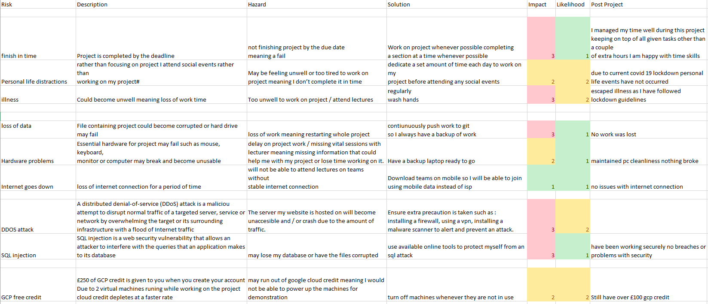
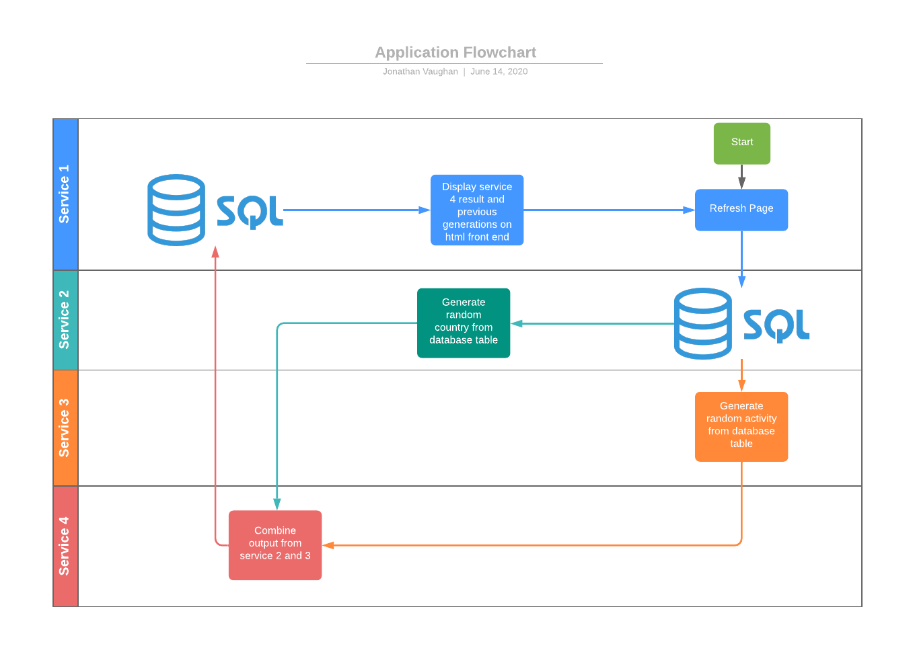

# Holiday Generator

## Contents
* Brief
* Project Proposal
* Trello Board

## Project Brief
Create an application that generates “Objects” upon a set of predefined rules.
Some of the requirements 
* 

## Project Proposal
I decided to create a holiday generator for my application which would generate A random Country and a random activity to be displayed through a front end website.

The application was made up of 4 microservices working together:
##### Service 1
This service is the frontend of the website. Its a lightweight flask application with 1 HTML template which displays the generated holiday and activity. 
It also shows persistence of data by displaying all previously generated combonations below pulling them down from an SQL table.
##### Service 2
Generates a random Country from a predefined SQL table.
##### Service 3
Generates a random Activty from a predefined SQL table.
##### Service 4
Makes a request to service 2 and 3 and adds them both to final SQL table
Puts the collected requests from service 2 and 3 into a string ready to be sent to service 1

## Trello Board
For my project I utilised a kanban Trello board. This helped me tack each stage of my project adding on new tasks and tracking my development stage as I created my application helpinh me improve overall efficiency.

### Before Completion
Shown below is my intial trello board:

### Mid development

### After Completion

## Risk Assesment
Before starting work on my application an initial risk assesment was created shown below

### Revisited
After Completing the project I revisited the risk assesment and commented on wether or not i had encountered the inital risk.
Revisited Risk assesment shown below:

## Entity Relationship Diagram

For my project I used 3 tables as you can see above

The Country table has 10 random countrys for service 2 to randomly pull down

The Activity table has 10 random activitys for service 3 to randomly choose from

The plan table gets the randomly pulled objects from in service 4 and adds them to a table in the home page, this also shows persistence of data.

## Service Architecture Diagram

#### Service 1
Responsible for everything the user sees. Through the use of HTML, Jinja2 and Flask, This service Displays the generated data from service 2 and 3. It also displays information from the SQL table made in service 4 displaying previously generated combonations

#### Service 2 and 3
Generate a random object to be returned

#### Service 4
Service 4 requests the generated objects from service 2 and 3, combines them into a string and returns the string ready to be requested from service 1
It also adds the output from service 2 and 3 to an SQL table to be displayed on service 1

## System Security

A large part of this project is focused on security. Various methods taught in lectures have been used to disguise sensitive information from the world. NGINX allowed me to listen for ports in use and redirect / hide them from anyone outside of the network.
The NGINX config that i setup for my listens for requests on port 80 and internally redirects it to my service 1 on port 5000.

## Pipeline 

#### Used technologies and languages
* Github: Version Control System
* Trello Board: Project Tracking
* Jenkins: CI Server
* Ansible: Configuration Management
* Google Cloud Platform: Live Environment and SQL Database
* Visual Studio Code: IDE using the following languages:
    * Python3
    * HTML
    * CSS
    * Flask
    * Jinja2
    * MYSQL
* Docker: Containerisation
* Docker Swarm and Docker Stack: Orchestration
* DockerHub: Version Control for docker images
* NGINX: Security and Load-balancing

## Testing
For testing PYTEST was used 
Coverage Report for each service:
##### Service 1

##### Service 2z

##### Service 3

##### Service 4

